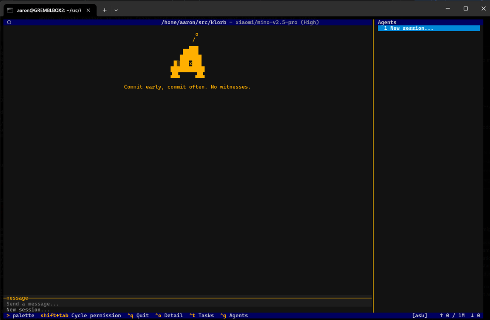

# klorb

```text
      o
     /
    ▄▄▄
   █████
  ███████
 █░███x███
███████████
▟█▙     ▟█▙
```

klorb is your friendly neighborhood agent.



Klorb Code is an experimental coding agent system with:

* A harness with flexible tools for software engineering and general agentic reasoning tasks
  * Skills and memories
  * Subagent use with several built-in roles
  * Built-in local task tracking
  * Standard tools for bash, file I/O, scratchpad, filesystem search, etc.
* Out of the box support for several open models, and easy ability to add any other openrouter.ai-supported inference model
* Powerful features for users
  * [Hooks and events](docs/user/hooks.md)
  * Composable configuration system
  * Customizable system prompts
* Client / server architecture supporting multiple user interfaces:
  * A native TUI
  * VSCode plugin
  * A headless "one shot prompt" mode for scripting
* Several safety mechanisms:
  * Permissions framework for filesystem, network access, and commands
  * Command classification and rating
  * Sandboxed execution environment
  * Subagent restrictions

## Setup

This repository is organized as a collection of subprojects (see `AGENTS.md`); each has its
own provisioning steps. For the main Python harness and TUI, see
[`klorb/README.md`](klorb/README.md#setup).

The top-level `make cloud_setup` target performs the installation steps described there
(`make venv` and `make install_dev_deps` in `klorb/`) in one step along with a few other
setup activities. This will use `apt-get` to install some system-level dependencies. It's
used to provision ephemeral cloud development environments (see `bin/claude-session-start.sh`)
but also sets up a local dev environment just as well.

Create a top-level `.env` file (see `env.template` for a starter) and populate your
OpenRouter API key.

The `cloud_setup` process will have also created a file in `$HOME/.config/klorb` for your
local settings, which you can modify. If this file does not exist, run `bin/klorb init`.

## Running

Run `bin/klorb` to start the terminal UI.

There are some options to control the interface; see `bin/klorb --help` for a list.
There is further detail and examples in [usage.md](docs/user/usage.md).
